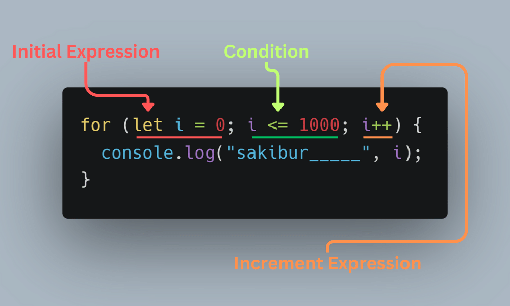

# JS-LOOP


## What Is Loop?

Looping in programming languages is a feature that facilitates the execution of a set of instructions/functions repeatedly while some condition evaluates to true.

## Different types of loops.

1. ### For loop

A `for loop` is used when you know how many times you need to repeat a certain block of code. It takes three statements.

- Initialization statement
- Condition Statement
- Increment statement.



Javascript:

```js
for (let i = 0; i <= 10; i++) {
  console.log(i, "__for loop");
}
```

Output:

```
'__for loop'
1 '__for loop'
2 '__for loop'
3 '__for loop'
4 '__for loop'
5 '__for loop'
6 '__for loop'
7 '__for loop'
8 '__for loop'
9 '__for loop'
10 '__for loop'

```

2. ### While loop

A `while loop` is used when you don’t know how many times you need to repeat a block of code, but you know the condition that will end the loop.

Javascript:

```js
let j = 0;
while (j <= 10) {
  console.log(j, "__while loop");
  j++;
}
```

Output:

```
0 '__while loop'
1 '__while loop'
2 '__while loop'
3 '__while loop'
4 '__while loop'
5 '__while loop'
6 '__while loop'
7 '__while loop'
8 '__while loop'
9 '__while loop'
10 '__while loop'

```

3. ### Do-While loop

A `do-while loop` is similar to a while loop, but the block of code is executed at least once, even if the condition is false.

Javascript:

```js

let l = 2;

do {
  console.log(l, "__do-while loop");
  l++;
} while (l <= 10);
}

```

Output:

```
2 '__do-while loop'
3 '__do-while loop'
4 '__do-while loop'
5 '__do-while loop'
6 '__do-while loop'
7 '__do-while loop'
8 '__do-while loop'
9 '__do-while loop'
10 '__do-while loop'

```

4. ### For-in loop

A `for-in loop` is used to loop through the properties of an object.

Javascript:

```js
const num = { a: 1, b: 9, c: 10 };

for (const prop in num) {
  console.log(prop + ": " + num[prop]);
}
```

Output:

```
 a: 1
 b: 9
 c: 10

```

5. ### For...of loop

A `for...of loop` is used to loop through the values of an iterable object.

Javascript:

```js
const numFor = [31, 22, 31];

for (let value of numFor) {
  console.log(value);
}
```

Output:

```
31
22
31

```

6. ### Map loop

A ` forEach loop` is a method on arrays that creates a new array by executing a function on each element in the array.

Javascript:

```js
const numMap = [10, 20, 30];
const newMap = numMap.map((valx) => valx * 2);
console.log(newMap);
```

Output:

```
(3) [20, 40, 60]

```
